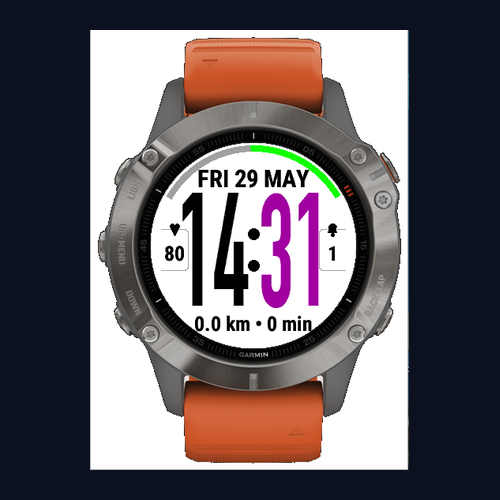
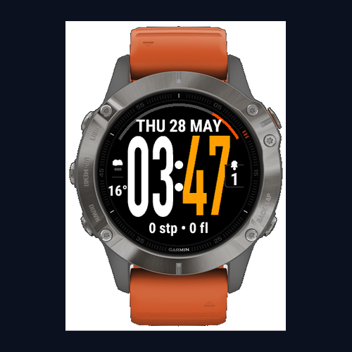

# SimpleGlance — Garmin Fenix 6 Watch Face

A clean, minimal digital watch face for the Garmin fenix 6 / fenix 6 Pro with fully user-configurable colours and data fields — no code editing required.



---

## Features

- **Large two-tone time** — hours and minutes in independently configurable colours, DIN Condensed Bold font
- **Date** — `DAY DD MON` format (e.g. `WED 20 MAY`)
- **Colon separator** — two filled dot colon between hours and minutes
- **12 / 24-hour mode** — toggle in Garmin Connect settings
- **Battery arc** — curved arc from 10 o'clock to 2 o'clock above the date; green (>50 %), orange (10–50 %), red (<10 %)
- **HR panel** — 3-sided rounded box with heart icon + current heart rate (bpm), overlaid on the left side of the hour digits
- **Notification box** — 3-sided rounded box with bell icon + count, overlaid on the right side of the minute digits
- **Bottom data row** — two user-selected fields from: Steps, Calories, Distance, Floors, Active Minutes, Elevation, or None
- **9 background colours** — Black, White, Red, Blue, Green, Orange, Purple, Pink, Grey
- **9 hour / minute colours** — same palette, independently chosen
- **Auto contrast** — all UI text and icons automatically switch white/black based on background brightness

---

## Settings (Garmin Connect app)

All customisation is done in **Garmin Connect → Watch Faces → SimpleGlance → Settings** — no rebuild needed.

| Setting | Options | Default |
| --- | --- | --- |
| Background Color | Black, White, Red, Blue, Green, Orange, Purple, Pink, Grey | Black |
| Hours Color | Same palette | White |
| Minutes Color | Same palette | Orange |
| Bottom Left Field | Steps, Calories, Distance, Floors, Active Minutes, Elevation, None | Steps |
| Bottom Right Field | Same options | Floors |
| 24-Hour Time | On / Off | Off (12 h) |

---

## Supported Devices

| Device | Screen | Status |
| --- | --- | --- |
| Garmin fenix 6 Pro | 260 × 260 px | ✓ Tested |
| Garmin fenix 6 | 260 × 260 px | ✓ Tested |
| Garmin fenix 6S | 240 × 240 px | Listed |
| Garmin fenix 6S Pro | 240 × 240 px | Listed |
| Garmin fenix 6X Pro | 280 × 280 px | Listed |

---

## Screenshots

| With watch | Face only |
| --- | --- |
|  |  |

---

## Prerequisites

- [Garmin Connect IQ SDK](https://developer.garmin.com/connect-iq/sdk/) 8.1.1+
- Java 11+ (Amazon Corretto 11 recommended on Apple Silicon)
- A Garmin developer key (see below)
- Python 3 + Pillow (for font atlas regeneration or store asset generation only)

---

## Developer Key

Generate once and place the output file at the project root:

```bash
openssl genrsa -out ~/.garmin_dev.key 4096
openssl pkcs8 -topk8 -inform PEM -outform DER -nocrypt \
  -in ~/.garmin_dev.key -out developer_key
```

---

## Build

```bash
SDK="/Users/$USER/Library/Application Support/Garmin/ConnectIQ/Sdks/connectiq-sdk-mac-8.1.1-2025-03-27-66dae750f"

java -Xms1g -Dfile.encoding=UTF-8 -Dapple.awt.UIElement=true \
  -jar "$SDK/bin/monkeybrains.jar" \
  -o bin/garminwatchface.prg \
  -f monkey.jungle \
  -y developer_key \
  -d fenix6pro_sim \
  -w
```

## Run in Simulator

```bash
$SDK/bin/monkeydo bin/garminwatchface.prg fenix6pro
```

To change settings in the simulator: **File → Edit Settings…**

---

## Install on Device

**1. Build a release package:**

```bash
java -Xms1g -Dfile.encoding=UTF-8 -Dapple.awt.UIElement=true \
  -jar "$SDK/bin/monkeybrains.jar" \
  -o bin/garminwatchface.iq \
  -f monkey.jungle \
  -y developer_key \
  -d fenix6pro \
  -e -r
```

**2. Copy to watch via USB:**

```bash
cp bin/garminwatchface.iq /Volumes/GARMIN/GARMIN/APPS/
```

Eject the device — the watch installs it on reboot.

---

## Changing the Time Font

Font atlases are generated by `tools/switch_font.py`. Available presets: `din` (default), `bebas`, `oswald`, `arial`, `hv_thin`, `sfpro`.

```bash
python3 tools/switch_font.py din        # regenerate with DIN Condensed Bold
python3 tools/switch_font.py list       # show all presets and availability
```

Key parameters in `switch_font.py`:

| Parameter | Default | Effect |
| --- | --- | --- |
| `CAP_H` | 145 | Digit height in pixels — increase for larger digits |
| `PAD` | 0 | Padding around each glyph cell — raise to 1–2 to add inter-digit gap |
| `width` (per preset) | 0.62 (DIN) | Horizontal squeeze factor — lower = narrower digits |

---

## Regenerating Store Assets

Place simulator screenshots in the `image-generators/` sub-folders, then run:

```bash
python3 image-generators/generate_store_assets.py
```

Outputs are written to `store_assets/`.

---

## Project Structure

```text
├── manifest.xml                       # App metadata, target devices, min API level
├── monkey.jungle                      # Build config
├── developer_key                      # DER signing key (not committed)
├── source/
│   ├── WatchFaceApp.mc                # App entry point, settings change hook
│   └── WatchFaceView.mc               # All drawing logic
├── resources/
│   ├── drawables/
│   │   ├── drawables.xml
│   │   └── launcher_icon.png          # 40×40 launcher icon
│   ├── fonts/
│   │   ├── fonts.xml                  # Font resource declaration
│   │   └── time_font.fnt / .png       # White-glyph atlas (tinted at runtime)
│   ├── layouts/
│   │   └── layout.xml
│   ├── settings/
│   │   ├── properties.xml             # Stored property defaults
│   │   └── settings.xml               # Garmin Connect settings UI definition
│   └── strings/
│       └── strings.xml                # App name + all setting label strings
├── store_assets/                      # Connect IQ store images
├── image-generators/
│   ├── generate_store_assets.py       # Generates cover, hero, and preview PNGs
│   ├── Cover/Cover.png                # Source screenshot for cover image
│   ├── Hero/Hero.png                  # Source screenshot for hero image
│   └── Preview/Preview1–3.png        # Source screenshots for previews
└── tools/
    ├── switch_font.py                 # Font atlas generator
    └── fonts/                         # Source TTF files
```

---

## Changelog

### 1.3.1

- Fix heart rate not displaying on device (switched to `ActivityMonitor.getHeartRateHistory` with full history window)

### 1.3.0

- Removed weather — dropped background service, HTTP fetching, and Open-Meteo integration
- Added HR panel: heart icon + live heart rate on the left side of the time digits (via SensorHistory)
- Added Elevation as a selectable bottom bar field
- Removed Weather Refresh Rate setting
- Replaced `Background`/`Communications`/`Positioning` permissions with `SensorHistory`

### 1.2.3

- Temperature now fetched from Open-Meteo via background service every 30 minutes
- Fixes temperature not showing due to Garmin weather sync omitting observation temp
- Graceful fallback when weather is disconnected: dim cloud placeholder and "--" shown
- Minimal always-on draw during battery-saving mode (date + time only)
- Notification count box: 3-sided rounded corners, bell icon stacked above count

### 1.1.0

- Added battery arc (10–2 o'clock, colour-coded green/orange/red)
- Added weather condition icon on left panel (sun, cloud, rain, snow, thunder, fog, wind and more)
- Added current temperature in °C below weather icon
- Added notification count box (3-sided rounded box overlaid on minute digits)
- Removed battery percentage icon and Bluetooth icon from face
- Added fenix 6X Pro to supported device list

### 1.0.0

- Initial release

---

## License

© 2026 Mahoneyclan. All rights reserved.
